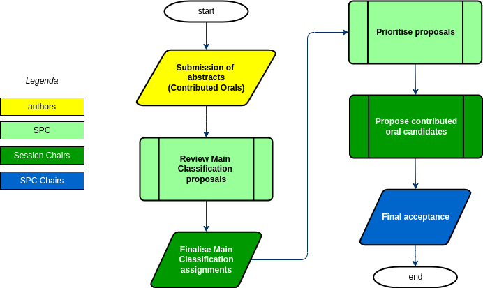

# Workflow of Oral Presentations acceptance

## Introduction

Conference programmes are generally composed of three types of 
presentation: *Invited Oral*, *Contributed Oral* and *Poster*. The ratio of 
the invited orals vs. contributed orals is decided by the Committee 
responsible for the scientific programme.

After having [selected the Invited Orals](InvidedOrals/intro.md) authors are allowed to submit their contributed abstracts, both of Oral and Poster type. The SPC then needs to select the proposed Contributed Orals and enter them in the conference programme.

## Normal workflow

The workflow for the selection of Contributed Oral Presenta

1. **authors** submit their abstracts consisting of a title, a brief description of what
    the talk will cover, one or more authors and a proposed Track/Session;
2. **SPC** members review the Track assignments of *all* proposed abstracts;
3. **Session Chairs** accept/reject requests of classification changes from previous step;
4. **SPC** members review all proposals by assigning priorities/scores;
5. **Session Chairs** review the priorities given in the previous step to produce a preliminary list of preferred contributed oral presentations and reserves;
6. the **SPC Chairs** review the proposals from the previous step, select the final candidates, put the contribut

