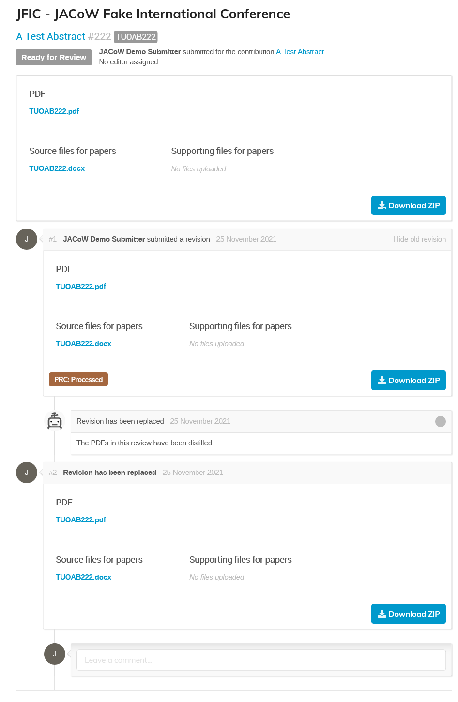

# Submit a paper to the conference

The explanations in this section supposes that you, as an author, have 
already submitted an abstract to the conference and that your abstract 
has been accepted. In this case you will see an additional menu item on 
the Indico page of the conference called “My Contributions” under the 
“My Conference” section.

Clicking on the contribution you wish to manage gives you access to the detailed page for it:

## Initial File Upload

Files sent to the editing process should be sent through the Editing section (not through the “Presentation materials” section!):

This section will appear only after the administrators have opened the submission.

In this section, you can usually submit files for up to three different editing processes: Papers, Slides and Posters (depending on the Editor-in-chief settings).

You can upload files to different folders (file types). Red stars indicate where a file is required. Once the file has been uploaded to the folder, the star becomes black. Each folder also indicates which file extensions are authorized and if the name of the uploaded file must follow a given naming scheme (it is likely that the programme code of the contribution will be requested in the file name).

The Submit button will be activated only when all required files will be uploaded and respecting the naming patterns.

Once submitted, you access the editing timeline of your contribution.

This page presents to you the status of the editing of your file and is where you will interact with the editor.

The upper box contains the current revision of your files (their latest version). Under it, you will see a timeline of all actions which have been taken during the editing process by the editor or by yourself by chronological order.

---

Each time your files are submitted in a JACoW conference, they will go through an automated distilling process which will ensure the quality of  the PDF, and will appear as a new revision in the timeline, triggered by a robot avatar 

---

