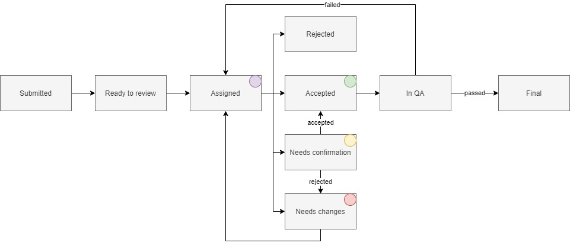

# Paper editing workflow

Paper editing in JACoW conferences refers to reviewing the layout and readability of a [paper submitted for the proceedings](https://www.jacow.org/Authors/HomePage) in relation to the [JACoW template](https://github.com/JACoW-org/JACoW_Templates/raw/master/LaTeX/A4/JACoW_LaTeX_A4.pdf).  

---

In the rest of this documentation we’ll refer to the document being assessed as an `editable` for the sake of simplification. Still in the case of the editing module, this document could be a paper, a slides deck or a poster. The editing process is exactly the same for all three types of documents.

---

## Editing States

The editable can be in one of the following states:

- **Submitted** - this is an "ephemeral" state (vanilla Indico) which is given to newly  submitted editables. As soon as they are submitted, the PDF files will be automatically processed ("distilled")  and the state will move to *Ready to Review*. The original file can still be accessed through the revision history;
- **Ready to Review** - the editable is ready to be assigned and reviewed by an editor. This means that "distilling" has been concluded. A system user called **Indico Bot** will do the distilling automatically and leave the editable in this state;
- **Assigned** - the editable has been assigned to an editor ("purple dot");
- **Accepted** - final state - the editable has been accepted ("green dot");
- **Rejected** - final state - the editable has been rejected; This status is usually not used in JACoW conferences
- **Needs changes** - the editable needs corrections to be performed **by the author(s)** ("red dot");
- **Needs confirmation** - the editor has made modifications to the editable, which **need to be approved** by the author(s) ("yellow dot");
- **In QA** - After the editor accepts the paper, the scientific secretary does a last quality check before the paper is published. This is characterised by an "Accepted" status and a "QA02: QA Pending" tag.
- **Final** - the editable is ready for publishing. This is characterized by an "Accepted" status and a "QA01: QA Approved" tag.

Here is a diagram of the editing states process:

